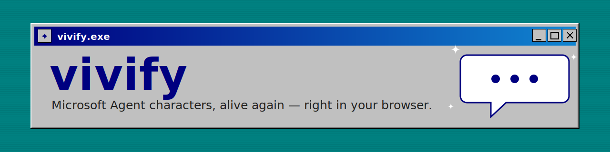

<!-- Banner: original artwork, ships no Microsoft/L&H imagery. See assets/banner.svg. -->



**Bring those animated characters from late-90s Windows back to life — right in your web browser.**

> _Before "Agent" had anything to do with AI… there were Genie, Merlin, and Clippy._

📖 **New here, or just curious?** Browse the **[documentation](docs/README.md)** — start with the
plain-English **["What is this?"](docs/what-is-this.md)**.

---

## ▶ See it move

There's no hosted click-to-try demo yet _(coming soon)_. But you can run the playground on your own
machine in about a minute — see **[Try it in 60 seconds](#-try-it-in-60-seconds)** below. It's a little
sandbox where you load a character, click its animations, and type to make it talk.

> 🎬 _An animated preview (a character actually moving and talking) is on the way — it's generated from the
> live demo, which arrives in a later step._

---

## What is this?

Back in the late 1990s, Microsoft made a thing called **Microsoft Agent**: little animated cartoon
helpers that lived on your Windows desktop. They walked around your screen, waved, talked out loud in a
synthesized voice, and showed a speech bubble with their words. The cast included **Genie** (a blue
genie), **Merlin** (a wizard), **Peedy** (a parrot), **Robby** (a robot), and the infamous **Clippy** (the
paperclip from Microsoft Office).

Microsoft retired the technology in Windows 7, and it quietly disappeared.

**vivify brings it back — faithfully — and runs it in a web browser.** It reads the original character
files, draws and animates the characters exactly as they were, shows their classic speech balloon, and can
even speak in their original voice. No old version of Windows required. Nothing to install on your
computer to just _look_ at it.

> 💾 **Remember when…** software came on a stack of floppy disks, "downloading" meant going to make a
> sandwich, and a tiny cartoon would pop up to "help" you write a letter? Yeah. This brings _that_ back.

👉 **Want the full story?** Read **[What is this?](docs/what-is-this.md)** — Microsoft Agent explained from
scratch, zero knowledge assumed.

#### A couple of words, in plain English

- **`.acs` file** — the single file that holds one character: all its pictures, animations, and sounds.
  (Microsoft's format. You supply your own — more on that below.) _See the
  **[glossary](docs/glossary.md)** for every term in plain English._
- **Lip-sync** — the character's mouth moving in time with the words it speaks.

---

## The cast

The original four — **Genie, Merlin, Peedy, Robby** — plus Office favorites like **Clippy** and **Rover**,
and any other character anyone ever made. If it's a `.acs` file, vivify aims to run it.

> 🖼️ _A picture gallery of the characters is coming once the demo-capture step lands._

---

## 🚀 Try it in 60 seconds

The quickest way to see a character on your screen today. You'll need two free tools and one character
file.

**1. Install [Docker Desktop](https://www.docker.com/products/docker-desktop/).** It's a free app that
runs the playground for you, so you don't have to set anything else up. _(Saw a scary-looking technical
message during install? Totally normal — just follow Docker's own prompts.)_

**2. Get this project and start the playground.** In a terminal, from this project's folder:

```bash
docker compose up mash
```

Then open **http://localhost:8090** in your browser. That's the playground. _(The `mash` part means "just
the visual playground, no voice setup needed" — the authentic voice is a separate, optional upgrade you can
add later.)_

**3. Load a character.** The playground ships with **no** characters (those belong to their owners — see
[What you supply](#what-you-supply)). Grab a free classic one from the community archive linked in
[`docs/legal-and-assets.md`](docs/legal-and-assets.md), then drag the `.acs` file onto the playground.

**That's it — it's alive!** Click any animation in the list to play it. Type a sentence and the character
shows its speech balloon. 🎉

> Want to hear the character's _real_ voice, not just see the balloon? That's the optional upgrade in
> [Want the real voice?](#want-the-real-voice) below.

---

## Install & full guides

Running the playground above is the fast path. When you're ready to set things up properly on your own
computer — including the authentic voice — there's a friendly, step-by-step guide for each operating
system:

- 🪟 **Windows** → [`docs/install/windows.md`](docs/install/windows.md) _(coming soon)_
- 🍎 **macOS** → [`docs/install/mac.md`](docs/install/mac.md) _(coming soon)_
- 🐧 **Linux** → [`docs/install/linux.md`](docs/install/linux.md) _(coming soon)_

New to all of this? Start with the gentle overview: [`docs/getting-started.md`](docs/getting-started.md)
_(coming soon)_.

---

## Want the real voice?

Seeing the character is one thing. Hearing it speak in its **original synthesized voice**, with its mouth
moving to match, is the magic.

That voice came from old Windows speech software that can't run in a browser directly, so vivify runs it in
a small background helper. It's a more involved, opt-in setup — completely separate from the quick
playground above — and there's a dedicated, hand-held walkthrough for it:

➡️ **[The authentic voice — what it is and how to set it up](docs/voice/overview.md)** _(coming soon)_

> Don't need the original voice? The playground still talks using your browser's built-in voice, so you
> never hit a dead end.

---

## For developers

vivify isn't just a demo — it's a **framework-agnostic engine** you can drop into your own site or app
(React, Vue, Svelte, or plain JavaScript). The API mirrors the classic Agent control: `show`, `play`,
`speak`, `moveTo`, `gestureAt`, `stop`, with an action queue.

```ts
import { createAgent } from "@vivify/core";

// Load a character from a raw .acs file's bytes (or pass a prebuilt bundle: { manifestUrl }).
const acs = await fetch("/agents/genie.acs").then((r) => r.arrayBuffer());
const genie = await createAgent(acs);

await genie.show();
await genie.play("Greet");
await genie.speak("You rubbed the lamp?"); // browser voice by default; authentic voice is opt-in
```

By default, speech uses the browser's built-in voice — so this works with **nothing else installed**. The
authentic voice is a clearly-labeled upgrade.

**The packages** (this is a pnpm monorepo):

- **`@vivify/core`** — the engine: load / show / play / speak / moveTo / gestureAt / stop. No framework
  dependency.
- **`@vivify/acs`** — the `.acs` parser + `acs2bundle` CLI. Runs in Node _and_ the browser.
- **`@vivify/voice-truvoice`** — the authentic-voice provider (talks to the voice server).
- **`services/voice-server`** — the Dockerized voice helper.
- **`apps/mash`** — the playground demo you ran above.

Full developer docs are on the way: [`docs/developers/overview.md`](docs/developers/overview.md) and a
copy-paste [`docs/developers/quickstart.md`](docs/developers/quickstart.md) _(coming soon)_. The
architecture is documented today in [`docs/architecture.md`](docs/architecture.md), and the build plan in
[`docs/roadmap.md`](docs/roadmap.md).

---

## What you supply

vivify is free and open-source, and it ships **no** Microsoft files and **no** characters. To keep things
clean and legal, _you_ bring two things yourself:

1. **Character files (`.acs`).** These are Microsoft's (and the community's) creations. You download the
   ones you want from the community archive — vivify never redistributes them.
2. **The speech software** — only if you want the authentic voice. It's old, free Microsoft/L&H speech
   software that you install into the voice helper.

It's all explained, with exactly where to get each piece, in
**[`docs/legal-and-assets.md`](docs/legal-and-assets.md)** (and a friendlier consumer guide is coming in
[`docs/voice/sourcing-components.md`](docs/voice/sourcing-components.md)).

> In short: the _engine_ is ours and open. The _characters and voices_ are their owners', and you supply
> your own copies.

---

## More help

- ❓ **FAQ** — "Is this legal?", "Why is there no sound?", "Which characters work?" →
  [`docs/faq.md`](docs/faq.md) _(coming soon)_
- 🛠️ **Troubleshooting** — common hiccups, per platform → [`docs/troubleshooting.md`](docs/troubleshooting.md)
  _(coming soon)_
- 📖 **Glossary** — every technical term, in plain English → [`docs/glossary.md`](docs/glossary.md)

---

## Credits

vivify stands on a lot of shoulders, gratefully: the original **Microsoft Agent** team who made these
characters; **DoubleAgent** (Cinnamon Software) and **Lebeau's MSAgent Decompiler** as references for the
`.acs` format; **clippy.js** for proving the characters could live again in a browser; **TETYYS/SAPI4** for
charting the path to the authentic voice; and **TMAFE** for keeping the character archive alive all these
years. See the full **[credits page](docs/credits.md)**.

---

## License

MIT © Kris Bennett.

vivify is **not** affiliated with or endorsed by Microsoft. The Microsoft Agent characters, the
SAPI4/TruVoice speech engine, and related assets are the property of their respective owners and are **not**
distributed by this project.
