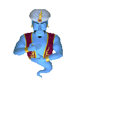

# Characters

The cast of Microsoft Agent — **Genie**, **Merlin**, **Peedy**, **Robby**, the infamous **Clippy**, and
any other character anyone ever made. If it's a `.acs` file, vivify aims to run it.

_The gallery grows as characters are captured. Here's Genie — load any `.acs` to meet the rest._

_…and in motion — Genie's "Greet", played straight from his original animation set._

## How to get your own `.acs` files

vivify ships **no** character files — they're Microsoft's, and you supply your own. The
**[Legal & assets](legal-and-assets.md)** page explains exactly where to find them and why we don't
bundle them. Once you have a `.acs`, drop it onto the playground (see any of the
[install guides](README.md)) and it runs.

## Where to next

- **New here?** Start with **[What is this?](what-is-this.md)** — zero knowledge assumed.
- **Want to set it up?** Pick your platform from the **[documentation home](README.md)**.
- **Where do the files come from?** See **[Legal & assets](legal-and-assets.md)**.

---

← Back to the **[documentation home](README.md)**
