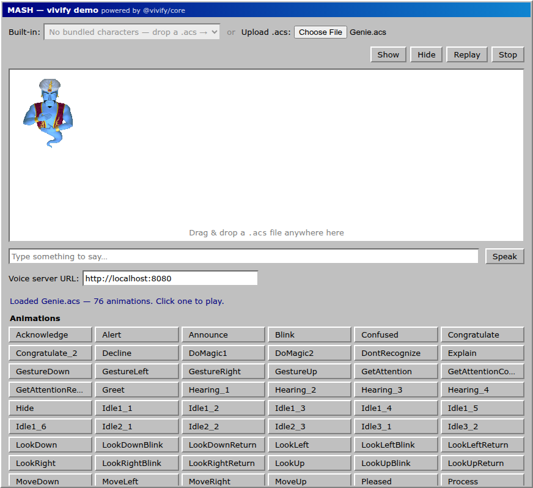

# Install vivify on Linux

Welcome! 👋 This guide takes you from a Linux machine to a cartoon character moving and talking in your web
browser. We'll explain every step, and you can stop after the easy part.

There are **two tiers**, and you can do just the first:

- **Tier 1 — See it run.** A character on screen, talking with your browser's built-in voice. Quick and
  easy.
- **Tier 2 — The authentic voice.** The original 1990s character voice. A little more setup, totally
  optional.

> New to all of this? The 60-second overview is **[What is this?](../what-is-this.md)**. Stuck on a word?
> The **[Glossary](../glossary.md)** explains every term in plain English.

> 📸 _Curious what success looks like? There's a screenshot of the running app at the end of Step 4._

---

## Tier 1 — See it run

This uses your **browser's built-in voice**. It's the easy on-ramp — not a lesser version — and it needs no
special files.

### Step 1 — Install Docker

**Docker** is free software that runs vivify for you, so you don't have to install a pile of separate pieces
by hand. On Linux, install **Docker Engine** plus the **Compose plugin**:

1. Follow the official guide for your distribution: **[Install Docker
   Engine](https://docs.docker.com/engine/install/)**. Use your distro's instructions (Ubuntu, Debian,
   Fedora, etc.) — the recommended setup includes the Compose plugin.
2. If you installed Docker some other way, make sure you also have the Compose plugin: **[Install the
   Compose plugin](https://docs.docker.com/compose/install/linux/)**. (Modern Docker uses **`docker
   compose`**, two words — _not_ the old `docker-compose` hyphen.)
3. _(Recommended)_ So you don't have to type `sudo` every time, add yourself to the `docker` group by
   following **[the post-install
   steps](https://docs.docker.com/engine/install/linux-postinstall/)** (then log out and back in). Prefer
   not to? No problem — just put **`sudo`** in front of the `docker` commands below.

> Prefer a graphical app like on Windows/Mac? **[Docker Desktop for
> Linux](https://docs.docker.com/desktop/setup/install/linux/)** works too.

**Check it's working:** open a terminal and run:

```bash
docker --version
docker compose version
```

If both print a version number, you're good.

### Step 2 — Get the vivify project

You need a copy of the project. Two ways — pick whichever sounds easier:

- **Easy (no tools):** on the project's GitHub page, click the green **`< > Code`** button → **Download
  ZIP**, then extract it. You'll get a folder named `vivify` (or similar).
- **If you have Git:** `git clone <the repo URL>`.

Open your terminal and move into the project folder with `cd`, for example:

```bash
cd ~/Downloads/vivify
```

### Step 3 — Start it

In that terminal, run:

```bash
docker compose up mash
```

_(If you skipped the `docker` group step, use `sudo docker compose up mash`.)_

The **first** time, Docker builds everything — this can take a few minutes. (After that it's cached and
starts fast.) When you see it settle and keep running, it's ready. Leave this terminal open.

### Step 4 — Open it and say hello

1. Open your web browser to **http://localhost:8090**.
2. You'll need a character file (a `.acs` file). vivify ships none — see **[where to get
   one](../legal-and-assets.md)** (and the **[Characters](../characters.md)** page). Drag
   the `.acs` file onto the page.
3. Click any animation in the list to play it. Type a sentence and click **Speak**.

**That's it — it's alive!** 🎉 The character moves, shows its speech balloon, and talks using your
browser's voice.



> To stop it: go back to the terminal and press **Ctrl + C**.

---

## Tier 2 — The authentic TruVoice voice _(optional)_

Want to hear the character's **real** 1990s voice instead of your browser's? That's this tier.

### Why you need to supply a few files

The original voice comes from closed 1990s Microsoft / Lernout & Hauspie speech software. It's not ours to
give away, so vivify can't include it — **you supply your own copies**, once. (This is also why vivify
stays free and clean to share.)

### Step 1 — Drop in three files

vivify looks for these in the folder **`services/voice-server/vendor/`** inside the project:

| File | What it is |
| --- | --- |
| `spchapi.exe` | The Microsoft SAPI 4 speech runtime |
| `tv_enua.exe` | The L&H TruVoice voice (Genie & friends) |
| `sdk/include/speech.h` | The SAPI 4 SDK header (goes in `vendor/sdk/include/`) |

**Where to find them:** see **[Legal & assets](../legal-and-assets.md)** — it lists the sources. _(We don't
link the files here, on purpose.)_

So the finished layout is:

```
services/voice-server/vendor/
  spchapi.exe
  tv_enua.exe
  sdk/include/speech.h
```

### Step 2 — One command

In your terminal, in the project folder:

```bash
docker compose up
```

_(Or `sudo docker compose up` if you skipped the `docker` group step.)_ That's the same command as before,
**without** `mash` — it now starts both the demo _and_ the voice. The first build is slower because it sets
up the voice engine; after that it's cached.

Then open **http://localhost:8090** as before. The voice connection is pre-filled for you
(`http://localhost:8080`), so just upload your `.acs`, type, and click **Speak** — and you'll hear the
authentic voice, with the mouth moving in time. 🪄

**Good to know:**

- **Docker is the only tool you need** — no programming tools to install.
- The **first time** you speak a brand-new sentence, it takes a few seconds to generate. The **same**
  sentence again is instant (vivify remembers it).
- A brand-new sentence may clip its very first instant slightly — minor, and it won't happen on a repeat.
- If the build stops with a message about **`speech.h` missing**, it means that file isn't in
  `services/voice-server/vendor/sdk/include/` yet — the message tells you the exact spot.

---

## Trouble?

- **[Troubleshooting](../troubleshooting.md)** — common hiccups and fixes.
- **[FAQ](../faq.md)** — "Is this legal?", "Why no sound?", "Which characters work?"
- **[Glossary](../glossary.md)** — every term, in plain English.

---

**Other platforms:** [Windows](windows.md) · [macOS](mac.md)

← Back to the **[documentation home](../README.md)** · [main README](../../README.md)
